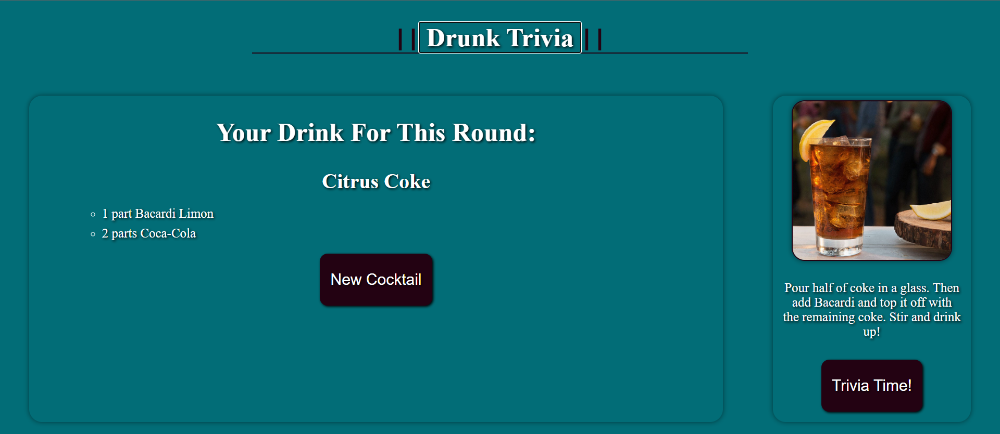

# DRUNK TRIVIA
## Purpose
The purpose of this application is to develop a fun drinking trivia game with friends and family!  
Upon opening the application the user will be presented with a prompt ensuring they are of legal drinking age within the United States of 21 years old.  
If the user selects yes they will be directed to the webpage to be prompted with directions on how the application works and a button beside that to create a alcoholic beverage. 
If the user selects no they will be redirected to a webpage on reddit talking about fake Id's. 
Upon selecting yes and generating a drink the user will be shown a drink to include:
- Name of the drink
- Ingredients and measurements
- Image of the drink
- Instructions on how to prep / mix the drink  
If the user does not like that drink they can select next cocktail to be presented with another random cocktail. 
Once the user decided on a cocktail they can select the trivia button and will be taken to seperate page and be able to select from one of 3 categories.  
- Sports
- Vehicles
- Politics  
Upon selecting a category the user will be prompted with the question and 4 multiple choice answers to choose from.  
Once they complete 5 questions they will be given a score of how they did and can go through another category and 5 more questions or go generate another drink.  

## Created with 
* HTML
* CSS
* JS

## Team cohesion
### Our Team consists of the following Developers:
- Gerus Hays [gitHublink](https://github.com/GerusHays)
- Alex Standfield [gitHublink](https://github.com/AlexStandfield)
- Kansas Carver [gitHublink](https://github.com/khcarver1)
- Merrick Watts [gitHublink](https://github.com/merrickwatts)
- David Johnson [gitHublink](https://github.com/GodofLuck00)

## Moving Forward
- We would like to implement team names into the application and to be able to see who has the highest scores of all time and win each round based on how many points they earn.
- Moving forward we should consolidate everything into one html file and implement css and javascript to make different parts of the app appear when certain functions are ran.
- Add a drop down to skim through drinks if the user knows what they want and wants to know how to make that specific drink instead of only generating a random one.
- Improve the styling and the looks of the application to be more appealing. 

## Web link:
- Project [website](https://gerushays.github.io/Drunk-Trivia/)

## Screenshot

## Powerpoint presentation describing the functionality
- Powerpoint [Link](https://docs.google.com/presentation/d/1-vZhp8ny7cAzyYAQ26ZL42vkJ87YG0jq/edit?usp=sharing&ouid=112282532490369923408&rtpof=true&sd=true)

## Contribution
Made by Team: Don't Drink and Code
